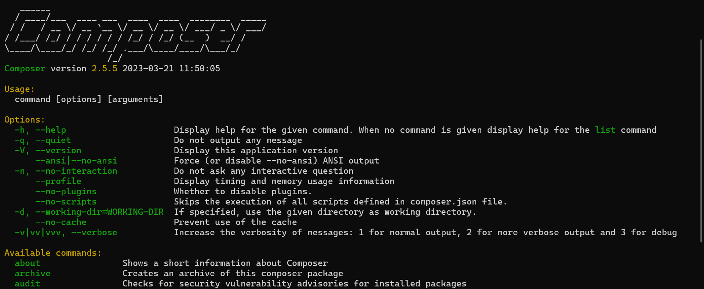

# Modul 0 Prerequisite Laravel

Pada modul ini, akan belajar mengenai apa saja yang diperlukan sebelum dapat menjalankan Laravel di laptop anda.

## Daftar Isi

1. [Instalasi XAMPP](#instalasi-xampp)
2. [Instalasi Composer](#instalasi-composer)
3. [Instalasi Laravel](#instalasi-laravel)

## Pendahuluan

Laravel merupakan salah satu kerangka kerja berbasis (framework) PHP yang cukup terkenal dan sering digunakan. Untuk dapat menggunakan Laravel diperlukan beberapa syarat agar dapat berjalan di device kita.

Berikut Merupakan beberapa tool yang diperlukan untuk menjalankan Laravel:

- PHP Version minimal `8.2` atau lebih
- Database Server (MySQL, PostgreSQL dan lainnya)
- Composer

Untuk tambahan perlu install beberapa tools seperti:

- Database Client (PhpMyAdmin,HeidiSQL dan lainnya)
- Code Editor (Visual Studio Code, PHPStorm, dan lainnya)

## Instalasi XAMPP

XAMPP merupakan salah satu software yang dapat digunakan untuk menjalankan PHP dan MySQL di device kita.
Akses halaman download XAMPP pada link [berikut](https://www.apachefriends.org/download.html)

Pilih download pada versi `8.2.12` tunggu hingga proses download dimulai. Lakukan instalasi seperti biasa hingga proses selesai.

Buka terminal anda (cmd atau powershell), ketikkan perintah  `SET PATH=%PATH%;C:\xampp\php`
>setelah titik koma merupakan lokasi instalasi xampp anda, ubah jika berbeda dengan folder default installation

Setelah selesai melakukan proses instalasi, buka terminal di windows ketikkan `php -v` jika berhasil maka akan muncul php version yang telah diinstall.

## Instalasi Composer

Akses halaman download composer pada link [ini](https://getcomposer.org/download/)

Klik link `Composer-Setup.exe` pada halaman tersebut didalam bagian windows installer, tunggu proses download hingga selesai.

Jalankan (run) Composer installation wizard. Abaikan jika Anda diminta untuk mengaktifkan mode developer. Lanjutkan proses install. Selanjutnya akan muncul jendela yang meminta Anda untuk mencari baris perintah PHP, namun dapat langsung kita next saja karena composer akan otomatis mencari php yang telah kita install. Klik next hingga muncul tombol install, klik tombol install dan tunggu hingga instalasi selesai. Setelah itu buka terminal anda dan coba ketikkan `composer -v` maka akan muncul seperti dibawah ini.

Jika gagal tutup dan buka kembali terminal anda, namun jika masih belum bisa lakukan restart pada device anda.

## Instalasi Laravel

Silahkan buka halaman dokumentasi laravel pada link [berikut](https://laravel.com/docs/11.x#creating-a-laravel-project)

Buka terminal anda dan arahkan pada directory yang diinginkan (anda dapat menggunakan perintah `cd` untuk merubah directory)

Ketikkan `composer create-project laravel/laravel <nama_folder_yang_diinginkan>`
>nama_folder_yang_diinginkan adalah nama folder yang akan dibuat oleh laravel, contoh `composer create-project laravel/laravel myproject` maka akan membuat folder myproject yang berisi file dan folder laravel.

Selanjutnya coba untuk membuka directory yang tadi dibuat dengan perintah `cd`. Lalu coba ketikkan di terminal `php artisan serve` jika proses berhasil maka di terminal akan tampil seperti berikut.

Maka sudah selesai, anda berhasil membuat sebuah project laravel!
