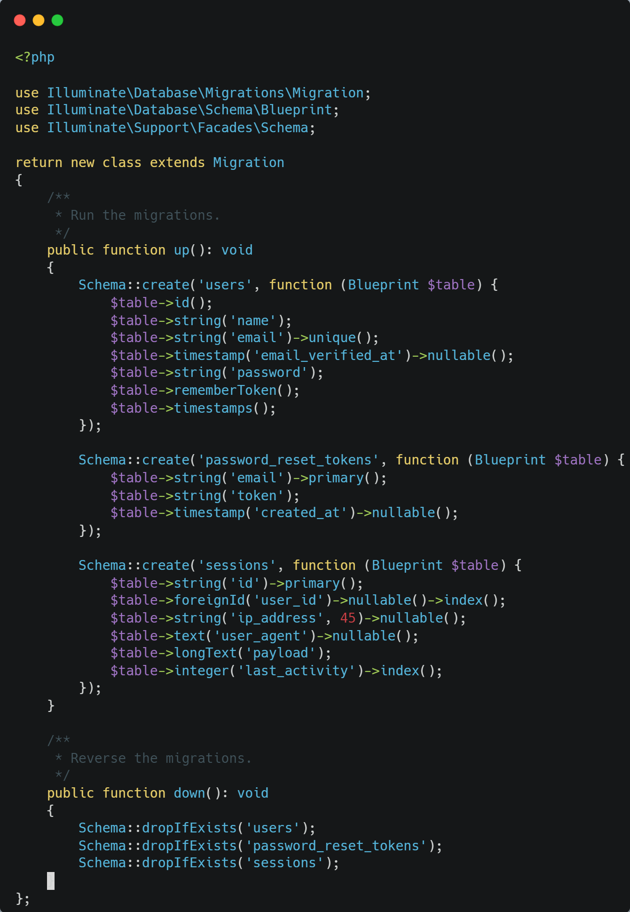
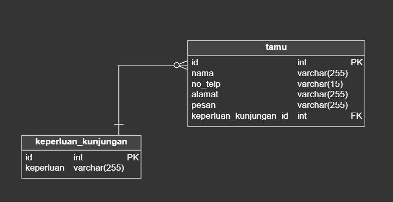
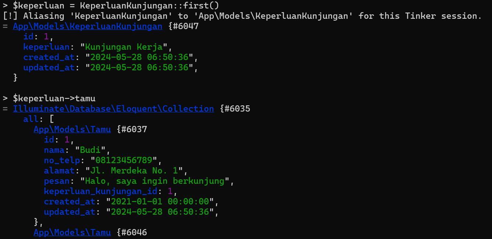

# Modul 2 CRUD, Database dan Authentication

## Daftar Isi

1. [Pendahuluan](#pendahuluan)

## Pendahuluan

1. Sebelum memulai ke tahap selanjutnya, pastikan anda untuk menyalakan database server dengan menuju ke aplikasi XAMPP kemudian klik start pada phpMyAdmin dan MySQL.

2. Selanjutnya buka file `.env` ubah value dari `DB_DATABASE` menjadi nama db yang anda inginkan. Tampilan file `.env` menjadi:

```env
DB_CONNECTION=mysql
DB_HOST=127.0.0.1
DB_PORT=3306
DB_DATABASE={nama database anda}
DB_USERNAME=root
DB_PASSWORD=
```

## Migration

Migration pada Laravel merupakan sebuah fitur yang dapat membantu kita mengelola database secara efisien dengan menggunakan kode. Migration membantu kita dalam membuat (create), mengubah (edit), dan menghapus (delete) struktur tabel dan kolom pada database milik kita dengan cepat dan mudah. Dengan menggunakan migration kita dapat membuat skema database secara langsung dengan mengeksekusi kode program, bukan melalui eksekusi query SQL. Dengan menggunakan migration, kita menggantikan query SQL dengan kode program PHP untuk membuat skema database kita.

### Struktur File Migration

Anda dapat langsung melihat salah satu file migration yang sudah dibuatkan oleh laravel ketika pertama kali kita menginstall pada path `database/migrations`. Misal kita buka pada file `0001_01_01_000000_create_users_table.php`



Pada file tersebut dapat dilihat ada dua function yaitu `up()` dan `down()`. Fungsi `up()` berisi perubahan struktur yang diinginkan, pada contoh fungsi tersebut dapat berisi beberapa `Schema::create()` yang berarti pada satu fungsi dapat membuat sekaligus beberapa tabel. Sementara fungsi `down()` berisi pembatalan aksi terhadap perubahan struktur yang dilakukan oleh `up()`.

### Perintah Migration

Berikut merupakan perintah yang dapat dijalankan di terminal berkaitan dengan migration:

```bash
# Menjalankan migrasi
php artisan migrate
# Mengembalikan perubahan database ke versi sebelum diubah
php artisan migrate:rollback

#Mengembalikan semua migrasi dan kemudian menjalankan perintah migrasi.
php artisan migrate:refresh

# Mereset Database dan melakukan migrasi ulang
php artisan migrate:fresh
```

### Membuat Migration

Pada modul 1 kita telah belajar untuk menampilkan data secara statis melalui array data yang kita buat, sekarang kita akan membuat sebuah table pada database yang akan menampung data dari aplikasi yang kita buat.

Untuk itu pertama kita dapat membuat sebuah migration file yang akan membuat sebuah table. Perintah untuk membuat migration adalah

```bash
php artisan make:migration create_[nama]_table
```

setelah berhasil membuat buka folder `database/migrations` untuk membuka file yang barusan dibuat. Misal kita akan membuat tabel keperluan kunjungan, maka pada fungsi `up()` dapat dituliskan.

```php
public function up()
{
    Schema::create('keperluan_kunjungan', function (Blueprint $table) {
        $table->id();
        $table->string('keperluan')->unique();
        $table->timestamps();
    });
}
```

> Untuk dapat mengetahui tipe data apa saja yang tersedia dapat dilihat di [sini](https://laravel.com/docs/11.x/migrations#available-column-types)



Coba buat juga untuk tabel tamu, dengan foreign key keperluan_kunjungan_id ke tabel keperluan_kunjungan. Dan lakukan migrate dengan perintah yang telah ditunjukkan diawal.

## Eloquent

Eloquent adalah ORM (Object Relational Mapping) yang disediakan oleh Laravel. Eloquent memungkinkan kita untuk berinteraksi dengan database menggunakan model-model yang kita buat. Dengan menggunakan Eloquent, kita dapat melakukan operasi-operasi CRUD (Create, Read, Update, Delete) pada database dengan mudah dan cepat.

### Connect Model ke Database

Pada `Model` yang telah kita buat di modul 1 dapat kita modifikasi agar mengambil data dari database dan juga memperbolehkan field mana saja yang diisi dengan menambahkan:

```php
    protected $table = [nama_tabel];
    protected $fillable = [field_yang_boleh_diisi];
```

Karena pada tabel tamu mempunyai foreign key, maka perlu ditambahkan relasi antar kedua `Model`. Sebelumnya perlu diketahui bahwa pada Laravel, Eloquent mempunyai beberapa jenis relation yaitu:

- hasOne
- hasMany
- belongsTo
- belongsToMany

Perlu diperhatikan bahwa `belongsTo` dan `belongsToMany` merupakan inverse dari `hasOne` dan `hasMany`, yang mana program akan mencocokkan foreign key model `belongsTo` ke primary key (id) dari model `has`. Maka jika dilihat dari tabel kita relation yang cocok adalah:

- Tamu.keperluan_kunjungan_id `belongsTo` keperluanKunjungan.id
- KeperluanKunjungan.id `hasMany` Tamu.keperluan_kunjungan_id

Maka pada model `Tamu` tambahkan:

```php
    use Illuminate\Database\Eloquent\Relations\BelongsTo;

    public function keperluan_kunjungan(): BelongsTo
    {
        return $this->belongsTo(KeperluanKunjungan::class, 'keperluan_kunjungan_id');
    }
```

Dan pada Model `KeperluanKunjungan` tambahkan:

```php
use Illuminate\Database\Eloquent\Relations\HasMany;

public function tamu(): HasMany
    {
        return $this->hasMany(Tamu::class, 'keperluan_kunjungan_id');
    }
```

### Manipulasi Data

Pada terminal jalankan perintah

```bash
php artisan tinker
```

Lalu coba masukkan data statis yang dibuat di modul sebelumnya, contoh input keperluan_kunjungan kemudian data tamu

```php
KeperluanKunjungan::create([
    'keperluan' => 'Kunjungan Akademik'
]);
```

```php
Tamu::create([
    'nama' => 'Budi',
    'no_telp' => '08123456789',
    'alamat' => 'Jl. Merdeka No. 1',
    'keperluan_kunjungan_id' => 1,
    'pesan' => 'Halo, saya ingin berkunjung',
]);
```



### Database Seeding

Seeder merupakan sebuah class yang memungkinkan kita sebagai web developer untuk mengisi database kita dengan data awal tanpa kita harus menginput manual satu satu, kali ini kita akan memindah data yang telah kita tulis di `Model` ke dalam seeder. Selain itu kita akan membuat data untuk `User`.

Untuk membuat seeder dapat dilakukan dengan mengetikkan perintah:

```bash
php artisan make:seeder [NamaSeeder]
```

Setelah itu buka file pada folder `database/seeders`, tuliskan kode pada fungsi run. Berikut contoh untuk seeding Model `User`

```php
public function run(): void
    {
        $userData = [
            [
                'id' => 1,
                'name' => 'haloo',
                'email' => 'halo@gmail.com',
                'password' => bcrypt('password'),
            ],
            [
                'id' => 2,
                'name' => 'testing',
                'email' => 'testing@gmail.com',
                'password' => bcrypt('password'),
            ]
        ];
        DB::beginTransaction();
        try {
            foreach ($userData as $data) {
                User::create($data);
            }
            DB::commit();
        } catch (\Exception $e) {
            DB::rollBack();
            throw $e;
        }
    }
```

Lalu untuk menjalankan seeder tambahkan kode berikut ke file `database/seeders/DatabaseSeeder.php`

```php
public function run(): void
    {
        $this->call([
            UserSeeder::class,
            KeperluanKunjunganSeeder::class,
            TamuSeeder::class,
        ]);
    }
```

Lalu pada terminal ketikkan:

```bash
php artisan db:seed
```

Sekarang coba rubah kode yang ada di Controller yang menggunakan method dari Model yang lama menjadi menggunakan eloquent

## CRUD (Create Read Update and Delete)

CRUD merupakan empat operasi dasar yang esensial dalam sebuah aplikasi. CRUD juga terkadang digunakan untuk mendeskripsikan konvensi interface pengguna yang memfasilitasi tampilan, pencarian, dan perubahan informasi menggunakan formulir dan laporan berbasis komputer.

CRUD adalah empat fungsi dasar yang seharusnya dapat dilakukan oleh sebuah model.

### CREATE

Create dapat juga diartikan sebagai menulis/write. Dengan kata lain, penambahan data ke dalam database ditampung dalam fungsi ini, sehingga fungsi ini biasa menggunakan http method POST.

Sekarang bagaimana bentuk implementasi pada aplikasi kita?

Buka file `routes/web.php` tambahkan method untuk post data tamu:

```php
    Route::post('/tamu', [\App\Http\Controllers\TamuController::class, 'store'])->name('tamu');
```

Selanjutnya Buka `TamuController` yang telah kita buat sebelumnya, kemudian buat sebuah fungsi bernama `store`.

```php
public function store(Request $request)
    {
        $validated = $request->validate([
            'nama' => 'required|string',
            'no_telp' => 'required|numeric|min_digits:10|max_digits:15',
            'alamat' => 'required|string',
            'keperluan_kunjungan_id' => 'required|exists:App\Models\KeperluanKunjungan,id',
            'pesan' => 'required|string'
        ]);

        Tamu::create($validated);
        return redirect('/')->with('success','Berhasil Menulis ke Daftar Tamu');
    }
```

pada fungsi diatas, setiap request yang dikirimkan akan divalidasi, dan jika sudah memenuhi validasi maka akan menggunakan eloquent model `Tamu` untuk create data. Setelah itu akan mengembalikan response berupa redirect dengan session data.

Selanjutnya buka file `main.blade.php` di `views`. Pada form tag tambahkan `method="POST"` dan pada `action={{ route('tamu) }}` serta setelah tag input form tambahkan `@csrf`. Lalu pada tiap input tag tambahkan kode menjadi seperti ini:

```html
<div class="mb-3">
  <label for="nama" class="form-label">Nama Lengkap</label>
  <div class="input-group">
    <input
      type="text"
      class="form-control @error('nama') is-invalid @enderror"
      id="nama"
      name="nama"
      placeholder="Masukkan Nama Lengkap..."
      aria-label="nama"
      value="{{old('nama')}}"
      required
    />
  </div>
  @error('nama')
  <span class="text-danger">{{$message}}</span>
  @enderror
</div>
```

- `@error('nama')` digunakan ketika ada error validasi dari nama akan ditangkap di blade
- `old('nama')` digunakan untuk menyimpan data yang telah diinputkan sebelumnya

Untuk menangkap session success yang diberikan saat berhasil store data maka dapat ditambahkan kode berikut tepat setelah tag div `class="card-body ..."`

```html
@if(session('success'))
<div class="alert alert-success alert-dismissible fade show" role="alert">
  {{session('success')}}
  <button
    type="button"
    class="btn-close"
    data-bs-dismiss="alert"
    aria-label="Close"
  ></button>
</div>
@endif
```

Sekarang coba lakukan pengisian data dan lihat apakah response succes berhasil muncul.

### READ

Read dapat juga diartikan sebagai membaca. Dengan kata lain, menampilkan data yang telah ada di database ditampung dalam fungsi ini, sehingga fungsi ini biasa menggunakan http method GET.

Untuk read kita akan membuat dua tipe halaman, yang pertama halaman untuk semua data dan yang kedua adalah detail data. Serta nanti pada get all data akan kita tambahkan filtering data menggunakan query parameter.

#### Detail Data

Pada `TamuController` buat fungsi `view()` dengan isi sebagai berikut:

```php
public function view($id)
{
    $tamu = Tamu::where('id', $id)->firstOrFail();
    return view('dashboard.view', compact('tamu'));
}
```

Lalu buat file `view.blade.php` pada folder `views/dashboard` dengan isi sebagai berikut:

```html
<div class="d-sm-flex align-items-center justify-content-between mb-4">
  <h1 class="h3 mb-0 text-gray-800">Detail Data Tamu</h1>
</div>
<div class="card shadow mb-4">
  <div class="card-header py-3">
    <h6 class="m-0 font-weight-bold text-primary">Data Tamu</h6>
  </div>
  <div class="card-body">
    <table class="table table-bordered">
      <tbody>
        <tr>
          <td>Nama</td>
          <td>{{$tamu['nama']}}</td>
        </tr>
        <tr>
          <td>Nomor Telepon</td>
          <td>{{$tamu['no_telp']}}</td>
        </tr>
        <tr>
          <td>Alamat Rumah</td>
          <td>{{$tamu['alamat']}}</td>
        </tr>
        <tr>
          <td>Keperluan Kunjungan</td>
          <td>{{$tamu->keperluan_kunjungan->keperluan}}</td>
        </tr>
        <tr>
          <td>Tanggal Kunjungan</td>
          <td>{{$tamu['created_at']->format('Y-m-d')}}</td>
        </tr>
        <tr>
          <td>Pesan</td>
          <td>{{$tamu->pesan}}</td>
        </tr>
      </tbody>
    </table>
  </div>
</div>
```

Pada `routes/web.php` tambahkan routing untuk halaman ini, karena untuk view ini ada di dashboard, tambahkan prefix `/dashboard`

```php
Route::get('/dashboard/tamu/{tamu:id}', [\App\Http\Controllers\TamuController::class, 'view'])->name('tamu.view');
```

#### Get All Data + Pagination dan Filtering data

Buka file `DashboardController` pada fungsi index modifikasi kode yang diberi menjadi:

```php
public function index(): View
{
    $tamu = Tamu::latest()->with('keperluan_kunjungan');

    $query_tanggal = request('tanggal');
    if($query_tanggal){
        $tamu = $tamu->whereDate('created_at',$query_tanggal);
    }

    return view('dashboard.main', [
        'tamus' => $tamu->paginate(5)->withQueryString()
    ]);
}
```

Pada kode diatas kita mengambil data dari Model Tamu yang paling terbaru menggunakan `latest` dan juga menggunakan `with()`. `with()` sendiri berguna untuk membuat eloquent menjadi eager load untuk mengatasi problem `N + 1` untuk penjelasan lanjut mengenai eager loading baca pada [dokumentasi ini](https://laravel.com/docs/11.x/eloquent-relationships#eager-loading). Selanjutnya kita ambil query paramater dari request yang bernama tanggal, selanjutnya dilakukan filtering jika ada request filter tanggal. Kemudian return berupa view dengan data yang telah dipaginasi sebanyak 5 items per halaman.

Sekarang akses view `dashboard/main.blade.php` sebelum tag table tambahkan potongan kode berikut:

```html
<div class="row">
  <div class="col-md-6 mb-3">
    <form action="/dashboard" method="get">
      <label for="tanggal" class="form-label">Tanggal Kunjungan</label>
      <div class="input-group">
        <input
          type="date"
          class="form-control"
          id="tanggal"
          name="tanggal"
          required
          value="{{request('tanggal')}}"
        />
        <button class="btn btn-outline-primary mx-3" type="submit">
          Filter
        </button>
      </div>
    </form>
  </div>
</div>
```

Lalu setelah tutup tag table tambahkan juga potongan kode berikut untuk menampilkan link paginasi.

```php
{{$tamus->links()}}
```

Sekarang coba akses halaman tersebut dan lihat apakah data sudah berjumlah sesuai dengan yang kita setting tadi. Namun bisa dilihat bahwa link paginasi sangat jelek, lalu gimana caranya agar link nya jadi aesthetic?

Buka file `app\Providers\AppServiceProvider.php` scroll pada fungsi `boot()` dan tambahkan kode berikut

```php
Paginator::useBootstrapFive();
```

### Update

Update dapat juga diartikan sebagai mengubah. Dengan kata lain, mengubah data yang telah ada di database ditampung dalam fungsi ini, sehingga fungsi ini bisa menggunakan http method PUT atau PATCH.

pada `TamuController` tambahkan buat fungsi update dan tambahkan kode berikut:

```php
  public function edit($id): View
  {
      $tamu = Tamu::where('id', $id)->firstOrFail();
      return view('dashboard.edit', [
          'tamu' => $tamu,
          'keperluan_kunjungans' => KeperluanKunjungan::all()
      ]);
  }
```

Pada route tambahkan route baru yaitu:

```php
Route::get('/dashboard/tamu/{tamu:id}/edit', [\App\Http\Controllers\TamuController::class, 'edit'])->name('tamu.edit');
Route::put('/tamu/{id}', [\App\Http\Controllers\TamuController::class, 'update'])->name('tamu.update');
```

Buat file view `dashboard/edit.blade.php` dengan isi berikut:

<details>

<summary>Click to see the code!</summary>

```html
@extends('dashboard.layouts.main') @section('title', 'Edit Data Tamu')
@section('content')
<div class="d-sm-flex align-items-center justify-content-between mb-4">
  <h1 class="h3 mb-0 text-gray-800">Dashboard</h1>
</div>
<div class="card shadow mb-4">
  <div class="card-header py-3">
    <h6 class="m-0 font-weight-bold text-primary">
      Edit data tamu : {{ $tamu->id }}
    </h6>
  </div>
  <div class="card-body">
    <form action="{{ route('tamu.update',$tamu->id) }}" method="post">
      @csrf @method('PUT')
      <div class="mb-3">
        <label for="nama" class="form-label">Nama Lengkap</label>
        <div class="input-group">
          <input
            type="text"
            class="form-control @error('nama') is-invalid @enderror"
            id="nama"
            name="nama"
            placeholder="Masukkan Nama Lengkap..."
            aria-label="nama"
            value="{{old('nama',$tamu->nama)}}"
            required
          />
        </div>
        @error('nama')
        <span class="text-danger">{{$message}}</span>
        @enderror
      </div>
      <div class="mb-3">
        <label for="no_telp" class="form-label">Nomor Telepon</label>
        <div class="input-group">
          <input
            type="tel"
            class="form-control @error('no_telp') is-invalid @enderror"
            id="no_telp"
            name="no_telp"
            placeholder="Masukkan Nomor Telepon"
            aria-label="no_telp"
            value="{{old('no_telp',$tamu->no_telp)}}"
            required
            minlength="10"
            maxlength="15"
          />
        </div>
        @error('no_telp')
        <span class="text-danger">{{$message}}</span>
        @enderror
      </div>
      <div class="mb-3">
        <label for="alamat" class="form-label">Alamat Rumah</label>
        <div class="input-group">
          <input
            type="text"
            class="form-control @error('alamat') is-invalid @enderror"
            id="alamat"
            name="alamat"
            value="{{old('alamat',$tamu->alamat)}}"
            placeholder="Masukkan Alamat Rumah..."
            aria-label="alamat"
            required
          />
        </div>
        @error('alamat')
        <span class="text-danger">{{$message}}</span>
        @enderror
      </div>
      <div class="mb-3">
        <label for="keperluan_kunjungan_id" class="form-label"
          >Keperluan Kunjungan</label
        >
        <div class="input-group">
          <select
            class="custom-select @error('keperluan_kunjungan_id') is-invalid @enderror"
            id="keperluan_kunjungan_id"
            name="keperluan_kunjungan_id"
            aria-label="keperluan_kunjungan_id"
            required
          >
            @foreach($keperluan_kunjungans as $keperluan_kunjungan) @if
            (old('keperluan_kunjungan_id') == $tamu->keperluan_kunjungan_id)
            <option value="{{$keperluan_kunjungan['id']}}" selected>
              {{$keperluan_kunjungan['keperluan']}}
            </option>
            @endif
            <option value="{{$keperluan_kunjungan['id']}}">
              {{$keperluan_kunjungan['keperluan']}}
            </option>
            @endforeach
          </select>
        </div>
        @error('keperluan_kunjungan_id')
        <span class="text-danger">{{$message}}</span>
        @enderror
      </div>
      <div class="mb-3">
        <label for="pesan" class="form-label">Pesan</label>
        <div class="input-group">
          <textarea
            class="form-control @error('pesan') is-invalid @enderror"
            id="pesan"
            name="pesan"
            placeholder="Masukkan Pesan..."
            aria-label="pesan"
            required
          >
{{ old('pesan',$tamu->pesan) }}</textarea
          >
        </div>
        @error('pesan')
        <span class="text-danger">{{$message}}</span>
        @enderror
      </div>
      <div class="d-grid">
        <button type="submit" class="btn btn-primary">Edit data</button>
      </div>
    </form>
  </div>
</div>
@endsection
```

</details>

Pada kode diatas kita menggunakan method PUT untuk mengupdate data, lalu kita menggunakan `@method('PUT')` untuk memberitahu bahwa method yang digunakan adalah PUT. Selanjutnya pada `TamuController` buat fungsi update dengan kode berikut:

```php
    public function update(Request $request, $id)
    {
        $tamu = Tamu::where('id', $id)->firstOrFail();
        $validated = $request->validate([
            'nama' => 'required|string',
            'no_telp' => 'required|numeric|min_digits:10|max_digits:15',
            'alamat' => 'required|string',
            'keperluan_kunjungan_id' => 'required|exists:App\Models\KeperluanKunjungan,id',
            'pesan' => 'required|string'
        ]);

        $tamu->update($validated);
        return redirect('/dashboard')->with('success', 'Berhasil Mengubah Data Tamu');
    }
```

### Delete

Untuk melakukan delete perlu ditambahkan `method('DELETE')` pada form. Untuk membuat fungsi delete maka pertama buka `TamuController` dan tambahkan fungsi `destroy()`

```php
public function destroy($id)
{
    $tamu = Tamu::where('id', $id)->firstOrFail();
    $tamu->delete();
    return redirect('/dashboard')->with('success', 'Berhasil Menghapus Data Tamu');
}
```

Lalu pada `routes/web.php` tambahkan route baru untuk delete

```php
Route::delete('/tamu/{id}', [\App\Http\Controllers\TamuController::class, 'destroy'])->name('tamu.destroy');
```

Lalu pada file `dashboard\main.blade.php` tambahkan kode berikut di dalam tabel:

```html
<form action="{{route('tamu.destroy',$tamu->id)}}" method="post">
  @csrf @method('delete')
  <button type="submit" class="btn btn-sm btn-danger">
    <i class="fas fa-trash"></i>
  </button>
</form>
```

## Authentication

Authentication pada laravel sudah sangat dimudahkan, kita hanya perlu menambahkan beberapa baris kode agar dapat menggunakan fitur authentication. Hal ini dikarenakan oleh laravel sudah disediakan base untuk auth.

### Membuat Login

Untuk membuat authentication, buka file `AuthController` tambahkan fungsi

```php
public function authenticate(Request $request): RedirectResponse
{
    $credentials = $request->validate([
        'email' => ['required', 'email'],
        'password' => ['required'],
    ]);

    if (Auth::attempt($credentials)) {
        $request->session()->regenerate();

        return redirect()->intended('/dashboard');
    }

    return back()->withErrors([
        'email' => 'The provided credentials do not match our records.',
    ])->onlyInput('email');
}
```

Pada `routes/web.php` tambahkan route untuk handle authenticate post:

```php
Route::post('/login', [AuthController::class, 'authenticate'])->name('login');
```

Pada file views login, lakukan perubahan agar form dapat disubmit dan handle error ketika validation.

### Middleware

Middleware adalah lapisan perantara antara permintaan route HTTP yang masuk dan action dari Controller yang akan dijalankan. Middleware memungkinkan kita untuk meakukan berbagai tugas baik itu sebelum ataupun sesudah tindakan dilakukan.

Pada kasus ini kita akan menggunakan middleware yang telah disediakan laravel untuk mengecek apakah user sudah terautentikasi.

pada `routes/web.php` tambahkan kode berikut untuk memberi middleware auth ke route yang diinginkan:

```php
Route::group([
    'middleware' => 'auth'
], function () {
    // isi dengan route yang diinginkan
});
```

### Logout

Untuk logout, buka file `AuthController` tambahkan fungsi berikut:

```php
public function logout(Request $request): RedirectResponse
{
    Auth::logout();

    $request->session()->invalidate();

    $request->session()->regenerateToken();

    return redirect('/');
}
```

Lalu pada `routes/web.php` tambahkan route untuk handle logout di dalam route middleware auth group:

```php
Route::post('/logout', [AuthController::class, 'logout'])->name('logout');
```

Lalu pada dashboard dan home yang mempunyai tombol fungsi logout tambahkan kode berikut:

```html
<!-- untuk home -->
<form method="POST" action="{{route('logout')}}">
  @csrf
  <button class="dropdown-item" type="submit"><i class="bi bi-box-arrow-right text-danger"></i> Logout</button>
</form>

<!-- untuk dashboard -->
<form action="{{route('logout')}}" method="post">
    @csrf
    <button class="btn btn-danger" type="submit"><i class="fas fa-sign-out-alt"></i> Logout</button>
</form>
```

Lalu kita bisa merubah data user yang sedang login dengan menggunakan `@auth` pada blade. Contoh pada home :

```html
@auth()
    <span class="navbar-text px-2">Hello, {{auth()->user()->name}}!</span>
    <!-- sisa kode -->
@endauth
@guest()
    <a href="{{route('login')}}" class="btn btn-outline-primary">Login</a>
@endguest
```
